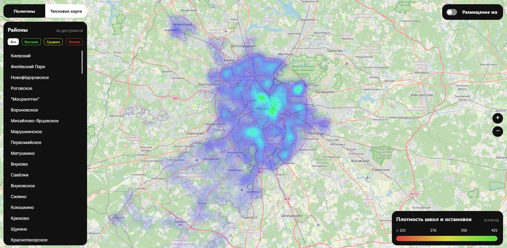
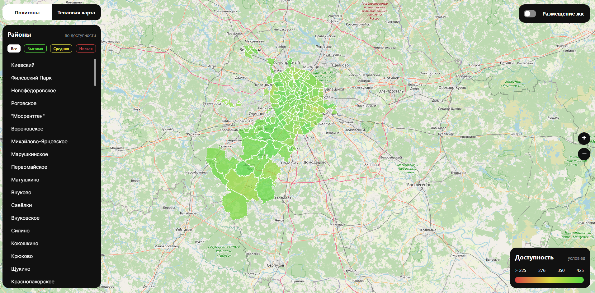

# ИИ-инструмент работы с данными перспективной городской застройки

## Описание

CitySpaceAI —  это веб-приложение, разработанное для упрощения процесса планирования и анализа городской застройки. Приложение позволяет пользователям визуализировать районы города, анализировать транспортную и пешеходную доступность до основных социально-значимых объектов, размещать жилые комплексы (ЖК) на карте, строить пешеходные дорожки с версионированием по годам, а также прогнозировать плотность и загруженность транспортных потоков при строительстве новых ЖК.


## Задача
### Подбор локаций для размещения рекламы
[Скачать данные по кейсу](https://lodmedia.hb.bizmrg.com/cases/1177112/%D0%94%D0%B5%D0%BF%D1%82%D1%80%D0%B0%D0%BD%D1%81.pdf)

При проектировании перспективной застройки города особое внимание уделяется транспортной доступности территории, в том числе пешеходной доступности до основных социально-значимых объектов. Дорожный граф с большим набором исходных данных является основой для расчета различных транспортных показателей и используется разными ведомствами при проектировании будущей застройки. 

Участникам хакатона необходимо создать инструмент с применением ИИ, который позволит принимать эффективные решения при строительстве жилых комплексов в части улучшения движения транспорта и пешеходов.

## Возможности

- **Оторбажение районов города Москва**
- **Тепловая карта** плотности школ и остановок
- **Функция размещения жилых комплексов (ЖК)**  с построением пешеходных дорожек и версионированием по годам
- **Прогнозирование плотности и загруженности**  при строительстве новых ЖК

## Список использованных технологий:

### Фронтенд
- **React**: Библиотека JavaScript для создания пользовательских интерфейсов.
- **Leaflet**: 
- **Redux**: Предсказуемое хранилище состояния для JavaScript-приложений.
- **Axios**: Клиент HTTP на основе промисов для браузера и Node.js.

### Бэкенд
- **FastApi**: Высокоуровневый веб-фреймворк на языке Python, способствующий быстрому разработке и удобству.
- **Pandas**: Быстрая, мощная, гибкая и простая в использовании библиотека для анализа и манипулирования данными в Python.
- **CatBoost**: Высокопроизводительная библиотека с открытым исходным кодом для градиентного бустинга на решающих деревьях.

### Дополнительные библиотеки
- **Joblib**: Набор инструментов для легкого конвейера в Python.
- **GeoPandas**: Проект с открытым исходным кодом для упрощения работы с геопространственными данными в Python.
- **OpenStreetMap**: Источник географических данных.

## Запуск проекта
```sh
   docker compose up --build
```

# Результаты

## Контакты
DS:
- https://github.com/jettooss
- https://github.com/BogdanRoshchupkin
- https://t.me/Alukiko          

FRONT:
- https://github.com/MarianRoshchupkin             

BACKEND:
- https://github.com/deZKI
